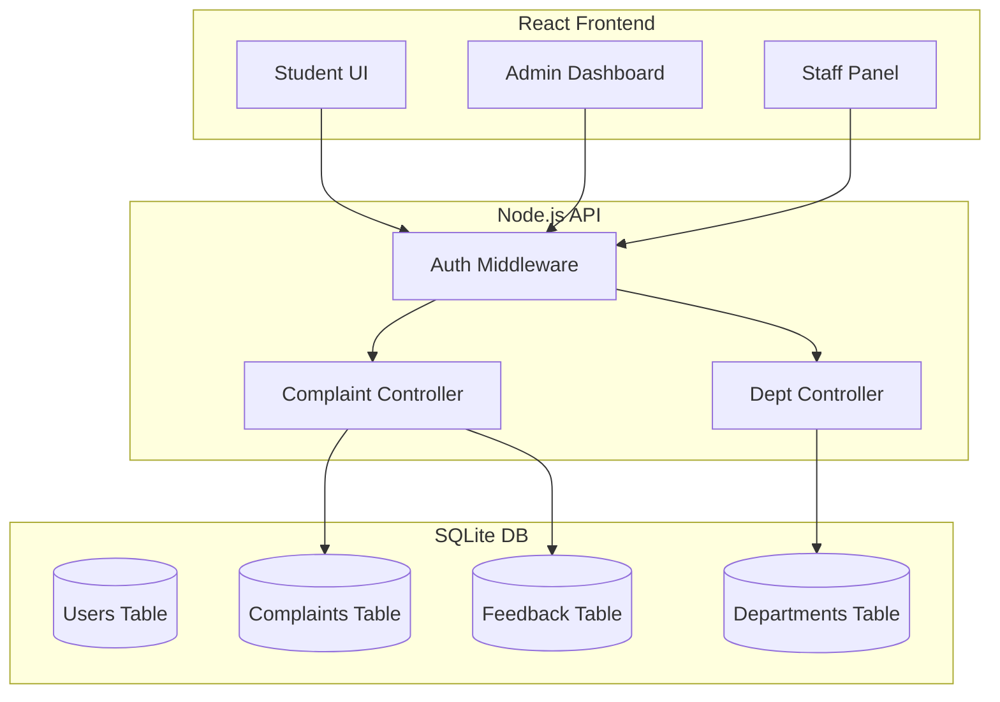

# System Architecture Diagram

## Database Schema (ER Summary)
- **Users**: 1 ---- N **Complaints** (Raised by)
- **Departments**: 1 ---- N **Complaints** (Assigned to)
- **Complaints**: 1 ---- 1 **Feedback** (Post-Resolution)
- **Departments**: 1 ---- N **Users** (Staff assigned to Dept)
